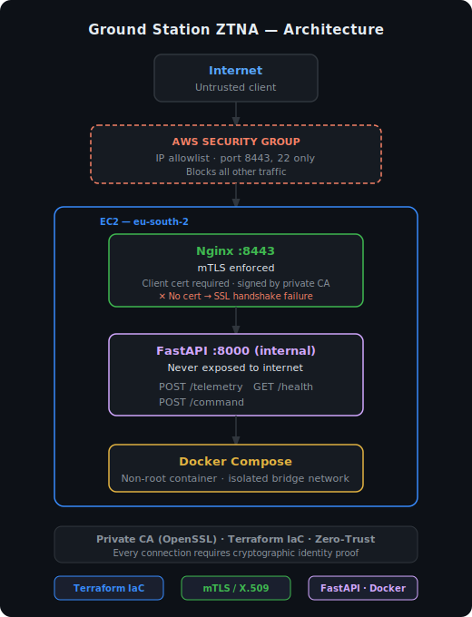

# Ground Station Zero-Trust Architecture

Production-grade Zero-Trust security architecture simulating a satellite ground station control center. Deploys a containerized telecommand API on AWS, protected by mutual TLS (mTLS) authentication — no valid certificate, no access.


---

## Architecture



```
Internet
    │
    ▼
[AWS Security Group] ── IP allowlist on ports 8443 / 22
    │
    ▼
[EC2 — eu-south-2]
    │
    ▼
[Nginx:8443] ── mTLS enforced (client certificate required)
    │              Only certs signed by private CA accepted
    ▼
[FastAPI:8000] ── never exposed directly
  POST /telemetry
  POST /command
  GET  /health
```

---

## Security Principles Demonstrated

| Principle | Implementation |
|---|---|
| Zero-Trust | Every connection requires cryptographic identity proof |
| Mutual TLS | Both server and client authenticate via X.509 certificates |
| Private CA | Self-hosted Certificate Authority — no public CA dependency |
| Least Privilege | EC2 Security Group allows only operator IP; Docker runs as non-root |
| Infrastructure as Code | Full environment reproducible via Terraform |
| Network Isolation | API never exposed directly — Nginx is the only entry point |

---

## Stack

- **Cloud:** AWS (VPC, Subnet, EC2, Security Group)
- **IaC:** Terraform
- **API:** Python + FastAPI
- **Containerization:** Docker + Docker Compose
- **Reverse Proxy / mTLS:** Nginx
- **Cryptography:** OpenSSL (private CA, server cert, client cert)

---

## Project Structure

```
ground-station-ztna/
├── terraform/          # AWS infrastructure (VPC, EC2, Security Group)
│   ├── providers.tf
│   ├── variables.tf
│   ├── main.tf
│   └── outputs.tf
├── app/                # Telecommand API
│   ├── main.py
│   ├── requirements.txt
│   └── Dockerfile
├── nginx/              # Reverse proxy with mTLS config
│   └── nginx.conf
├── tests/              # pytest API test suite
│   └── test_api.py
├── docs/
│   └── architecture.svg
├── certs/              # Generated locally — not committed (see Certificates section)
└── docker-compose.yml
```

---

## API

```python
from fastapi import FastAPI, HTTPException
from pydantic import BaseModel

app = FastAPI(title="Ground Station Control API")

class Command(BaseModel):
    satellite_id: str
    command_type: str   # REBOOT | ADJUST_ORBIT | DEPLOY_ANTENNA | SAFE_MODE
    parameters: dict = {}

@app.post("/command")
def send_command(cmd: Command):
    ALLOWED = {"REBOOT", "ADJUST_ORBIT", "DEPLOY_ANTENNA", "SAFE_MODE"}
    if cmd.command_type not in ALLOWED:
        raise HTTPException(status_code=400, detail=f"Command '{cmd.command_type}' not authorized")
    return {"status": "dispatched", "command": cmd.command_type}

@app.post("/telemetry")
def receive_telemetry(data: TelemetryData):
    # Logs altitude, battery, signal; alerts on battery < 10%
    return {"status": "accepted", "satellite_id": data.satellite_id}

@app.get("/health")
def health_check():
    return {"status": "operational", "timestamp": datetime.now(timezone.utc).isoformat()}
```

All endpoints are reached exclusively through Nginx on port 8443, which enforces mTLS before proxying to FastAPI on port 8000.

---

## Prerequisites

- AWS account with IAM user and Access Keys configured (`aws configure --profile spacesec`)
- Terraform >= 1.3
- OpenSSL
- Docker + Docker Compose v2

---

## Deployment

### 1. Infrastructure

```bash
cd terraform
terraform init
terraform plan
terraform apply
```

Note your EC2 public IP from the output.

### 2. Generate Certificates

```bash
mkdir -p certs && cd certs

# Private CA
openssl genrsa -out ca.key 4096
openssl req -new -x509 -days 3650 -key ca.key -out ca.crt \
  -subj "/C=ES/ST=Madrid/O=GroundStationCA/CN=GS-RootCA"

# Server certificate (replace with your EC2 IP)
openssl genrsa -out server.key 4096
openssl req -new -key server.key -out server.csr \
  -subj "/C=ES/ST=Madrid/O=GroundStation/CN=<EC2_PUBLIC_IP>"
openssl x509 -req -days 365 -in server.csr \
  -CA ca.crt -CAkey ca.key -CAcreateserial -out server.crt

# Client certificate (authorized operator)
openssl genrsa -out client.key 4096
openssl req -new -key client.key -out client.csr \
  -subj "/C=ES/ST=Madrid/O=GroundStation/CN=OperadorAutorizado"
openssl x509 -req -days 365 -in client.csr \
  -CA ca.crt -CAkey ca.key -CAcreateserial -out client.crt
```

> **Note:** Certificates are generated locally and excluded from version control (see `.gitignore`). The `certs/` directory is tracked via a `.gitkeep` placeholder.

### 3. Deploy to EC2

```bash
scp -r app certs nginx docker-compose.yml ec2-user@<EC2_IP>:~/ground-station-ztna/
ssh -i ~/.ssh/id_rsa ec2-user@<EC2_IP>
cd ground-station-ztna && docker compose up -d
```

---

## Verification

**Without certificate — must fail:**
```bash
curl -k https://<EC2_IP>:8443/health
# Expected: SSL handshake failure
```

**With valid client certificate — must succeed:**
```bash
curl --cacert certs/ca.crt \
     --cert certs/client.crt \
     --key  certs/client.key \
     https://<EC2_IP>:8443/health
# Expected: {"status":"operational","timestamp":"..."}
```

**Send a telecommand:**
```bash
curl --cacert certs/ca.crt \
     --cert certs/client.crt \
     --key  certs/client.key \
     -X POST https://<EC2_IP>:8443/command \
     -H "Content-Type: application/json" \
     -d '{"satellite_id":"SAT-01","command_type":"SAFE_MODE","parameters":{}}'
```

---

## Running Tests

```bash
pip install -r app/requirements.txt httpx pytest
pytest tests/ -v
```

---

## CI/CD

GitHub Actions runs on every push and pull request:

| Job | What it checks |
|---|---|
| `terraform-validate` | `terraform fmt` + `terraform validate` |
| `api-tests` | Full pytest suite against the FastAPI app |
| `docker-build` | `docker build` of the API image |

---

## Teardown

```bash
cd terraform
terraform destroy
```

---

## Author

Carlos Agudo — Zero-Trust infrastructure applied to aerospace ground station control systems.
